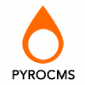

> Update as of August 2020 - PyroCMS now relies upon Laravel.

So lately I've been playing around with [PyroCMS](http://pyrocms.com/) , for any of you who don’t know about Pyro, its basically an open source content  management solution that iss based on the CodeIgnitor framework. What does that mean you ask?

- MVC design pattern. (Model->View->Controller)
- Security,  Cross-Site Request Forgery protection, XSS filtering and very secure password encryption.
- Caching, in order to achieve maximum performance.
- Translated into 16 languages!
- Extremely lightweight!
- Support for modules, themes, plugins and widgets!
- Multi – Site Manager (In Pro Version £45 )

Really it takes the pain out of  making your standard websites, you'll have an area where the client can update their website in a simple environment and thanks to 'permissions' you can be sure they won’t mess anything up!

Of course there is always going to be a stage when your better off without a framework, but for projects that it will work for, [PyroCMS](http://pyrocms.com/) will save you a BUNCH of time!